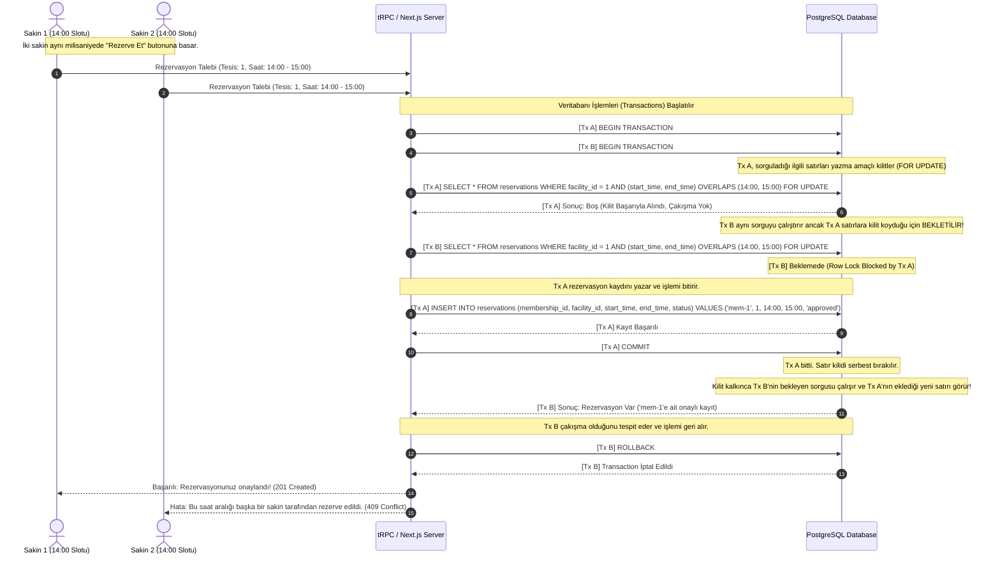

# komşu.site - Rezervasyon Concurrency & Kilitleme Mekanizması

---

## 1. Concurrency (Eşzamanlılık) Problemi Tanımı
Toplu konut ve sitelerde tenis kortu, halı saha, sinema salonu gibi rezervasyonla çalışan sosyal tesislerin sayısı sınırlıdır. Popüler saatlerde (örneğin hafta sonu akşam saatleri) birden fazla sakin aynı tesisin aynı saat dilimi için saniyeler hatta milisaniyeler farkla rezervasyon tuşuna basabilir.

Klasik veri okuma ve yazma işlemlerinde (Read -> Check -> Write) şu senaryo gerçekleşir:
1. **Sakin A** boş saati sorgular (Boş görür).
2. **Sakin B** aynı boş saati sorgular (Boş görür).
3. **Sakin A** kaydı ekler.
4. **Sakin B** de kaydı ekler.
5. **Sonuç:** Çifte Rezervasyon (Double-Booking) hatası oluşur ve sistem güvenilirliğini yitirir.

**komşu.site**, bu çakışmayı veri tabanı katmanında **PostgreSQL Row-Level Locking (Satır Düzeyinde Kilitleme)** ve `SELECT ... FOR UPDATE` mimarisi kullanarak %100 oranında önler.

---

## 2. Eşzamanlı Kilitleme Akış Şeması (Sequence Diagram)

Aşağıdaki sequence diyagramı, iki sakinin aynı tesis slotunu aynı anda rezerve etmeye çalışması durumunda Next.js API katmanı ile PostgreSQL arasındaki işlem sırasını ve kilitleme aşamalarını göstermektedir:



---

## 3. Kod Seviyesinde Uygulama (tRPC & Drizzle ORM Örneği)

İşlemin tRPC router'ı üzerinde Drizzle ORM ile uygulanma mantığı şu şekildedir:

```typescript
await db.transaction(async (tx) => {
  // 1. SELECT FOR UPDATE ile çakışan kayıtları sorgula ve kilitle
  const existingReservations = await tx
    .select()
    .from(reservations)
    .where(
      and(
        eq(reservations.facilityId, input.facilityId),
        eq(reservations.status, "approved"),
        // Çakışan saat aralığı kontrolü
        sql`(start_time, end_time) OVERLAPS (${input.startTime}, ${input.endTime})`
      )
    )
    .for("update"); // Satır kilitleme (FOR UPDATE)

  if (existingReservations.length > 0) {
    // Çakışma varsa hata fırlat ve Transaction'ı Rollback yap
    throw new TRPCError({
      code: "CONFLICT",
      message: "Tesis bu saat aralığında doludur.",
    });
  }

  // 2. Çakışma yoksa yeni kaydı oluştur
  await tx.insert(reservations).values({
    membershipId: ctx.membershipId,
    facilityId: input.facilityId,
    startTime: input.startTime,
    endTime: input.endTime,
    status: "approved",
  });
});
```

---

## 4. Performans ve Güvenlik Kazanımları
* **Sıfır Çakışma Riski:** Yazılımsal `if-else` kontrolleri yerine veritabanı motorunun ACID standartlarında kilit mekanizması kullanılmıştır.
* **Bellek Verimliliği:** Redis vb. harici bir dağıtık kilit (distributed lock) sunucusuna ihtiyaç duymadan, mevcut PostgreSQL veritabanı yetenekleriyle çözülmüştür.
* **Adil Kullanım:** Aynı anda istek gönderen sakinlerden milisaniye bazında ilk gelenin işlemi önceliklendirilir, diğerleri sıraya alınır.
