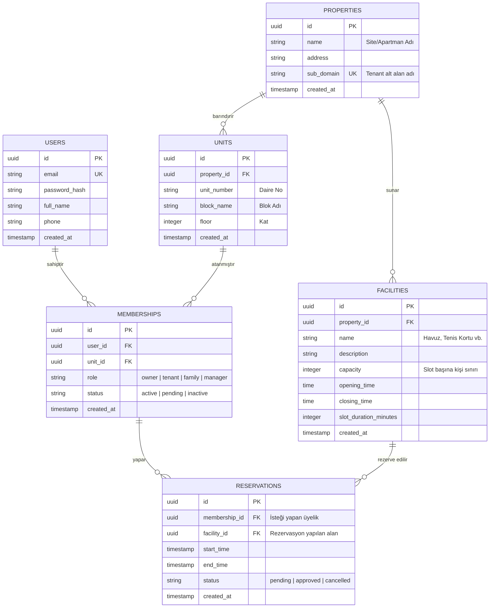

# komşu.site - Çoklu Mülk İlişkisel Veritabanı Şeması (ERD)

---

## 1. Mimari Genel Bakış
**komşu.site** (apartman-plus-resident-ops), modern rezidans, toplu konut ve site yönetimlerinin operasyonel ihtiyaçlarını karşılamak üzere geliştirilmiş çok kiracılı (multi-tenant) B2B SaaS Resident Portal ürünüdür.

Bu sistemin en kritik özelliklerinden biri, **Çoklu Mülk (Multi-Unit/Multi-Property)** desteğidir. Bir kullanıcı (örneğin hem A blok Daire 4'ün sahibi olan hem de B blok Daire 12'de kiracı olarak yaşayan bir sakin) sisteme tek bir e-posta adresiyle kaydolup, hesapları arasında şifre girmeden anlık geçiş yapabilmektedir. Bu işlem HTTP isteklerinin başlığında (Header) taşınan `x-membership-id` bilgisiyle kontrol edilmektedir.

---

## 2. İlişkisel Veritabanı Şeması (ERD)

Sistemdeki veritabanı tabloları ve aralarındaki ilişkiler aşağıdaki Mermaid.js diyagramında gösterilmiştir:

---

## 3. Tablo ve İlişki Açıklamaları

### 3.1 USERS (Kullanıcılar)
Tüm sistemdeki temel kimlik doğrulama (authentication) tablosudur. E-posta adresi tekildir. Kullanıcının hangi site veya dairelerde yetkisi olduğu bu tabloda tutulmaz; ilişkiler gevşek tutularak güvenlik ve ölçeklenebilirlik sağlanır.

### 3.2 PROPERTIES (Mülkler / Siteler)
Her bir site veya rezidans yönetimi (Tenant) bu tabloda bir satır olarak temsil edilir. `sub_domain` alanı, o sitenin kendi özel portal arayüzüne erişimini sağlar (Örn: `yakut-sitesi.komsu.site`).

### 3.3 UNITS (Daireler / Bağımsız Bölümler)
Bir siteye ait fiziksel daireleri tanımlar. `property_id` ile doğrudan mülke bağlıdır.

### 3.4 MEMBERSHIPS (Üyelikler & Roller)
Çoklu mülk yapısının kalbidir. Bir `user_id` ve `unit_id` ikilisini birleştirir.
* `x-membership-id` HTTP başlığı bu tablodaki `id` değerine karşılık gelir.
* Kullanıcı sisteme girdiğinde aktif üyeliklerinden birini seçer ve sonraki tüm tRPC / REST API sorguları bu üyelik bağlamında (`context`) yürütülür.
* `role` alanı sayesinde kullanıcı bir dairede "Kat Maliki" (owner) iken, diğer dairede "Kiracı" (tenant) veya "Aile Bireyi" (family) olabilir.

### 3.5 FACILITIES (Sosyal Tesisler)
Sitedeki ortak alanları (tenis kortu, spor salonu, sauna vb.) temsil eder. Rezervasyon kısıtları ve slot süreleri burada belirlenir.

### 3.6 RESERVATIONS (Rezervasyonlar)
Sakinlerin sosyal tesisler için oluşturduğu rezervasyon kayıtlarıdır. Bir `membership_id` ile ilişkilendirilmiştir; böylece hangi üyenin, hangi daire adına rezervasyon yaptığı takip edilebilir. Concurrency (çakışma) yönetiminde bu tablo kritik rol oynar.
