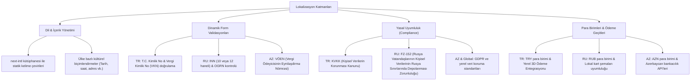

# Hızır Global - Çok Uluslu Lokalizasyon & Gereksinim Analiz Raporu

---

## 1. Giriş ve Amaç
Bu rapor, Hızır Global'in kurumsal platformunun ve bayilik başvuru altyapısının hedef pazarlar olan **Türkiye (TR)**, **Rusya (RU)**, **Azerbaycan (AZ)** ve **Global (EN)** pazarlarının kültürel, yasal ve teknik gereksinimlerine uyum sağlaması amacıyla hazırlanmıştır. 

Çok uluslu operasyonlarda tek bir form yapısı kullanmak; yanlış veri girişine, yasal uyumluluk ihlallerine ve düşük form dönüşüm oranlarına (conversion rate) yol açar. Bu nedenle her pazarın kimlik doğrulama, finansal mevzuat ve kişisel verilerin korunması kanunları analiz edilerek esnek ve dinamik bir lokalizasyon mimarisi oluşturulmuştur.

---

## 2. Lokalizasyon Katmanları Yapısı (Mindmap)

Aşağıdaki diyagram, platformun çok dilli yapıda desteklediği lokalizasyon bileşenlerini ve kapsamını özetlemektedir:

---

## 3. Pazarlara Göre Detaylı Gereksinim Matrisi

| Parametre | Türkiye (TR) | Rusya (RU) | Azerbaycan (AZ) | Global / Diğer (EN) |
| :--- | :--- | :--- | :--- | :--- |
| **Desteklenen Dil** | Türkçe | Rusça | Azerbaycan Türkçesi | İngilizce |
| **Para Birimi** | TRY (₺) | RUB (₽) | AZN (₼) | USD ($) / EUR (€) |
| **Veri Koruma Kanunu** | KVKK (Açık rıza metinleri ve ticari ileti onayları zorunlu) | FZ-152 (Tüm kullanıcı kişisel verileri ülke içi sunucularda barındırılmalı) | Yerel Veri Koruma Kanunu (GDPR uyumlu politikalar) | GDPR / CCPA (Kapsamlı çerez politikası ve "Unutulma Hakkı") |
| **Kimlik Doğrulama** | T.C. Kimlik No (Nüfus Müdürlüğü API entegrasyonu ile doğrulanabilir) | INN (Kişisel/Kurumsal Vergi Numarası) doğrulaması | VÖEN ve Kimlik Serisi / FİN Kodu doğrulaması | Pasaport No / Şirket Sicil No |
| **Telefon Formatı** | +90 (5XX) XXX XX XX | +7 (9XX) XXX XX XX | +994 (XX) XXX XX XX | Ülke kodu seçicili dinamik format |
| **Adres Yapısı** | İl / İlçe / Mahalle / Sokak (Sabit hiyerarşi) | Eyalet / Şehir / Sokak (Açık adres formatı) | Şehir / Rayon / Sokak | Serbest Metin |

---

## 4. Dinamik Form Alanları ve Validasyon Mantığı (Technical Spec)

Sisteme giren aday, formun başında ülkesini seçtiğinde backend ve frontend validasyon şemaları dinamik olarak değiştirilir:

### 4.1 Türkiye (TR) Validasyonu
* **T.C. Kimlik No:** 11 haneli olmalı, matematiksel algoritma kontrolünden geçmelidir (Son hane çift, ilk 10 hane toplamının 10'a bölümü 11. haneyi vermeli vb.).
* **Vergi Numarası:** 10 haneli olmalı ve Gelir İdaresi Başkanlığı standartlarına göre checksum doğrulaması yapılmalıdır.

### 4.2 Rusya (RU) Validasyonu
* **INN (ИНН):** Bireysel başvurular için 12 hane, tüzel kişilikler için 10 haneli olmalı, Rusya Federal Vergi Servisi (FNS) standart algoritmasıyla kontrol edilmelidir.

### 4.3 Azerbaycan (AZ) Validasyonu
* **VÖEN:** 10 haneli olmalı, son hanesi kontrol basamağı olarak kontrol edilmelidir.
* **FİN Kodu:** Kimlik kartı üzerinde yer alan 7 haneli benzersiz kod alanı olmalıdır.

---

## 5. Altyapısal Kararlar & Çözümler
1. **Frontend Entegrasyonu:** Proje Next.js üzerinde kurulduğu için çok dillilik yönetimi `next-intl` kütüphanesiyle yapılmıştır. URL yapısı dile göre `/tr/franchise`, `/ru/franchise` şeklinde SEO dostu olarak yönlendirilir.
2. **FZ-152 Rusya Veri Lokalizasyonu Yasası:** Rusya'dan gelen başvuruların kişisel verileri (ad, soyad, telefon vb.), Rusya sınırları içindeki bir Yandex Cloud sunucusunda depolanır. TR/AZ ve Global verileri ise Türkiye merkezli veri merkezlerinde izole edilir. API katmanı, isteğin IP adresine ve seçilen dile göre veriyi ilgili coğrafi veri tabanına yönlendirir.
