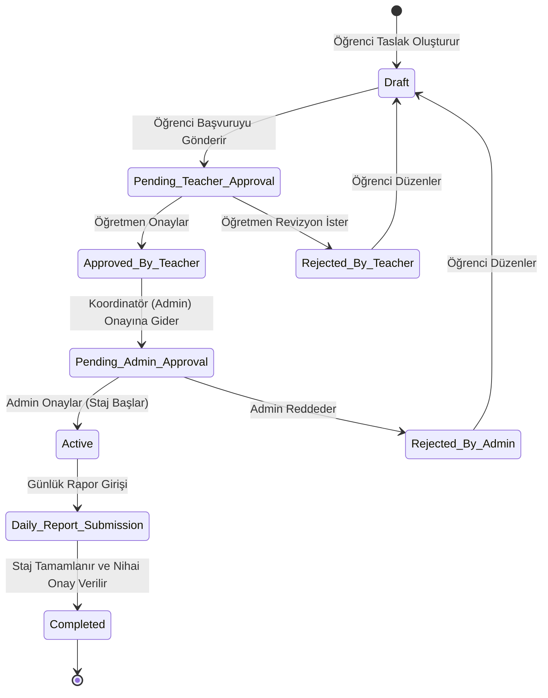

# Kariyer Takip Portalı - Ürün Gereksinim Dokümanı (PRD)

---

## 1. Doküman Kontrolü & Genel Bakış
* **Proje Adı:** Kariyer Takip Portalı
* **Doküman Sürümü:** v1.2
* **Tarih:** 15 Ağustos 2024
* **Hazırlayan:** Evren Keskin (Product Owner & Lead Developer)
* **Durum:** Onaylandı / Yayında

### 1.1 Amaç
Bu doküman, Fatih Sultan Mehmet Vakıf Üniversitesi bünyesinde staj başvuru, takip ve değerlendirme süreçlerini dijitalleştirmek amacıyla geliştirilen **Kariyer Takip Portalı**'nın ürün gereksinimlerini (PRD) tanımlar. Sistem; dağınık e-posta zincirlerini, ıslak imzalı fiziki form takibini ve manuel Excel dosyalarını ortadan kaldırarak öğrenci, öğretmen ve koordinatör (admin) rollerini tek bir SaaS platformunda birleştirmeyi hedefler.

---

## 2. Kullanıcı Rolleri & Yetkilendirme (RBAC)

Sistem, Rol Tabanlı Erişim Kontrolü (RBAC) altyapısına sahiptir. Her kullanıcı rolünün sisteme giriş yaptıktan sonra erişebileceği modüller ve gerçekleştirebileceği eylemler aşağıda tanımlanmıştır:

| Rol | Tanım | Yetkiler |
| :--- | :--- | :--- |
| **Öğrenci** | Staj yapacak aday | Başvuru oluşturma, evrak yükleme, günlük rapor (staj defteri) girişi yapma, staj durumunu izleme. |
| **Öğretmen** | Staj danışmanı | Kendisine atanan öğrencilerin başvurularını inceleme, günlük raporları okuma/onaylama, revizyon talep etme. |
| **Admin (Koordinatör)** | Sistem yöneticisi | Kullanıcı yönetimi (öğrenci-öğretmen eşleştirme), staj yeri onaylama, nihai staj onayını verme, sistem parametrelerini yönetme. |

---

## 3. Temel Özellikler & Fonksiyonel Gereksinimler

### 3.1 Başvuru ve Evrak Yönetimi
* **Gereksinim 3.1.1:** Öğrenciler, staj yapmak istedikleri şirket bilgilerini ve staj tarihlerini girerek başvuru başlatabilmelidir.
* **Gereksinim 3.1.2:** Sistem, PDF formatındaki zorunlu belgelerin (Sigorta Beyan Formu, Müstehaklık Belgesi vb.) yüklenmesini zorunlu tutmalıdır.
* **Gereksinim 3.1.3:** Form alanları (Örn: TC Kimlik No, Staj Gün Sayısı) frontend ve backend seviyesinde doğrulanmalıdır (Validation).

### 3.2 Onay ve Değerlendirme Akışı
* **Gereksinim 3.2.1:** Öğrenci başvurusunu gönderdiğinde ilgili staj danışmanına (Öğretmen) otomatik e-posta bildirimi gitmelidir.
* **Gereksinim 3.2.2:** Öğretmen, başvuruyu onaylayabilir veya açıklama girerek revizyona gönderebilir.
* **Gereksinim 3.2.3:** Öğretmen onayından geçen başvurular, nihai imza ve onay için Koordinatör (Admin) ekranına düşmelidir.

### 3.3 Günlük Defter Takibi (Daily Reports)
* **Gereksinim 3.3.1:** Stajı başlayan öğrenci, her staj günü için yaptığı çalışmaları içeren günlük rapor girişi yapmalıdır.
* **Gereksinim 3.3.2:** Sistem, staj bitiş tarihine kadar günlük raporların geriye dönük girilmesine veya düzenlenmesine izin vermelidir.
* **Gereksinim 3.3.3:** Danışman öğretmen, haftalık bazda bu raporları inceleyip puanlayabilmelidir.

---

## 4. Staj Başvurusu Yaşam Döngüsü (State Machine)

Aşağıdaki diyagram staj başvurusunun sistemdeki akışını ve durum değişikliklerini göstermektedir:

---

## 5. Teknik Gereksinimler & Kısıtlar
* **Backend Teknolojisi:** .NET Core Web API / Razor Pages (Mimari temiz kod ve CQRS prensiplerine uygun olmalıdır).
* **Veritabanı:** PostgreSQL (İlişkisel bütünlük ve indeksler staj tarihleri üzerinde optimize edilmelidir).
* **Güvenlik:** Parolalar BCrypt algoritması ile hashlenmeli, tüm API istekleri JWT (JSON Web Token) ile doğrulanmalıdır.
* **Dosya Depolama:** Yüklenen evraklar ve staj defterleri şifrelenmiş dosya sunucusunda (veya AWS S3 uyumlu bir nesne depolama sisteminde) saklanmalıdır.

---

## 6. Başarı Metrikleri (KPIs)
* **Onay Süresi Azalması:** Islak imza ve elden evrak takibine kıyasla ortalama başvuru onay süresinin **%80 oranında düşürülmesi**.
* **Evrak Kaybı:** Başvuru sürecinde kaybolan evrak veya eksik bilgi girişinin **%0'a düşürülmesi** (zorunlu alan validasyonları ile).
* **Sistem Kullanımı:** Öğrenci ve öğretmenlerin sisteme aktif adaptasyon oranı (Hedef: **%100**).
