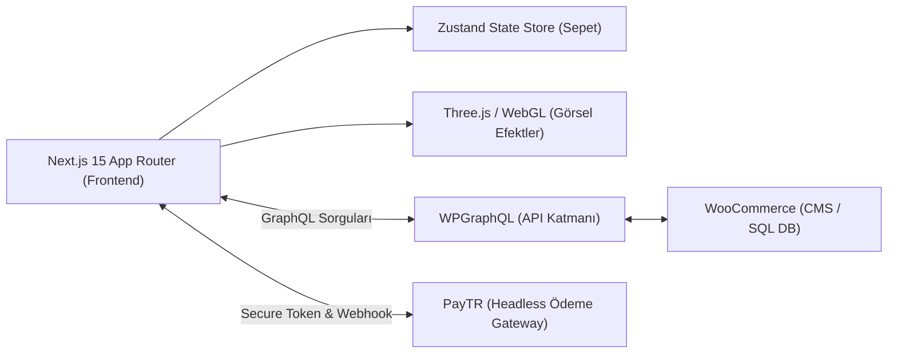
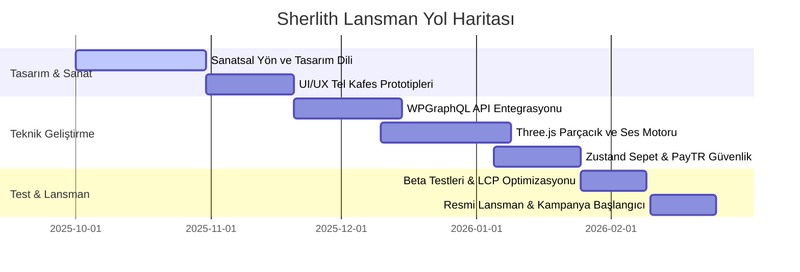

# Sherlith: Bir Gotik E-ticaret Evreni Lansman Sunumu

---

## Slide 1: Başlık & Vizyon

### **SHERLITH**
*E-ticaret ile Sanatı ve Atmosferik Anlatıyı Birleştiren Headless Web Deneyimi*

* **Hazırlayan:** Evren Keskin (Lead Product Owner & Technical Architect)
* **Tarih:** 2025
* **Vizyon:** Klasik, tek düze e-ticaret şablonlarını yıkarak, kullanıcılara gotik edebiyat, lore (hikâye anlatımı), atmosferik müzik ve interaktif 3D bileşenlerle bezenmiş büyüleyici bir alışveriş serüveni sunmak.

---

## Slide 2: Problem Tanımı

### **E-ticarette "Ruh" Eksikliği**

1. **İşlemsel Odak (Transactional Focus):** Mevcut e-ticaret platformları kullanıcıyı sadece sepete ürün eklemeye ve ödeme yapmaya yönlendirir; marka sadakati ve duygusal bağ kurmakta yetersiz kalır.
2. **Kısıtlayıcı Altyapılar (Monolithic Frameworks):** WooCommerce veya Shopify gibi monolitik şablonlar, yüksek performanslı animasyonları, kesintisiz ses çalarları ve özel 3D WebGL (Three.js) sahnelerini desteklemez. Sayfa her yenilendiğinde müzik ve atmosfer kesintiye uğrar.
3. **Standart Tasarımlar:** Neredeyse tüm e-ticaret sitelerinin aynı ızgara (grid) yapısı ve beyaz arka plan ile birbirine benzemesi, niş markaların kendilerini ifade etmesini zorlaştırır.

---

## Slide 3: Çözüm

### **Bütüncül ve Headless Dijital Evren**

* **Headless Mimari:** WordPress/WooCommerce veri tabanını sadece bir arka ofis (CMS) olarak kullanıp, ön yüzü (Next.js) tamamen özgürce tasarlamak.
* **Atmosferik Arayüz (Ambient UI):** Sayfa geçişlerinde asla kesilmeyen gotik arka plan müzikleri, fare hareketlerine tepki veren Three.js parçacık efektleri ve karanlık tasarım dili.
* **Hikaye Anlatımı (Lore Entegrasyonu):** Satılan her ürünün gotik bir şiir ve arka plan hikâyesiyle sunulması; dil değiştirildiğinde (TR/EN) bu şiirlerin özel poetik çeviri sistemiyle anlamını kaybetmeden sunulması.

---

## Slide 4: Teknik Mimari

### **Yüksek Performanslı Teknoloji Stack'i**

---

## Slide 5: Öne Çıkan Kullanıcı Deneyimi (UX) Unsurları

1. **Mikroskobik Büyüteç (Micro-Magnifier):** Ürünlerin kumaş, doku ve işleme detaylarını en yüksek kalitede incelemek için tasarlanmış, performansı optimize edilmiş özel görseller.
2. **Kesintisiz Ambient Müzik Çalar:** Next.js SPA (Single Page Application) yapısı sayesinde, kullanıcı sayfalar arasında gezinirken müzik takılmaz ve atmosfer bozulmaz.
3. **Zustand Tabanlı Instant-Cart:** Sepete ekleme, adet artırma ve çıkarma işlemlerinde API sunucusuna istek atılmaz; işlem Zustand ile tarayıcı hafızasında milisaniyeler içinde güncellenir.
4. **Çift Dilli Poetik Çeviri Motoru:** Sanatsal ruhu korumak adına standart çeviri araçları yerine, profesyonel edebi çevirilerin dinamik olarak yüklendiği sistem.

---

## Slide 6: Proje Geliştirme Yol Haritası (Timeline)

Projenin tasarım aşamasından beta lansmanına kadar olan süreç aşağıdaki Gantt şemasında planlanmıştır:

---

## Slide 7: Hedeflenen Başarı Metrikleri (KPIs)

* **Sitede Kalma Süresi:** Klasik e-ticaret sitelerindeki ortalama sitede kalma süresinin, interaktif içerik ve Lore sayesinde **%250 artırılması**.
* **Sepet Terk Etme Oranı:** Zustand tabanlı anlık sepet reaksiyonları ve optimize edilmiş PayTR tek sayfa ödeme akışı sayesinde sepeti terk etme oranlarında **%30 düşüş**.
* **API Yanıt Hızı:** WPGraphQL ve Next.js ISR (Incremental Static Regeneration) sayesinde API yanıt sürelerinin **%50 oranında optimize edilmesi**.
