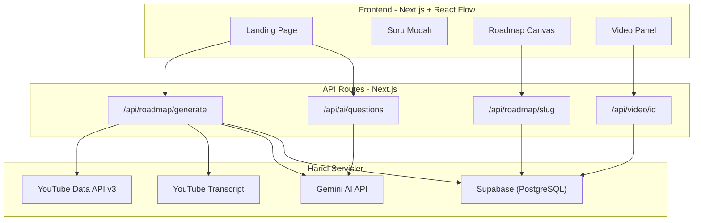
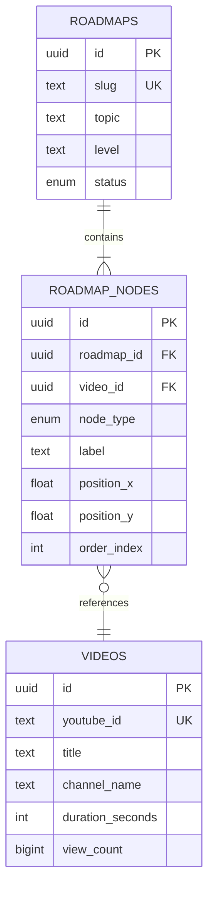

# Sistem Mimarisi ve AI Pipeline: WatchPath

## 1. Mimari Genel Bakış
WatchPath, Next.js App Router üzerinde inşa edilmiş, sunucu tarafında API işlemleri yürüten ve istemci tarafında React Flow ile zengin etkileşim sunan modern bir Full-Stack uygulamasıdır.

## 2. AI Tabanlı İçerik Keşif Motoru (Pipeline)
YouTube Data API'nin kotalarını aşmamak ve eski (kaldırılmış) endpointlerin eksikliğini gidermek için özel bir keşif mekanizması geliştirilmiştir:

1. **Arama Genişletme:** Kullanıcının girdiği konu AI tarafından alt kırılımlara ve daha iyi arama terimlerine bölünür (Örn: "React" -> "React Hooks", "React State Management").
2. **Toplu Veri Çekme:** Türetilen terimler ile YouTube Search API taranır. Günde 100 arama limiti `search_cache` tablosunda 7 günlük TTL ile optimize edilir.
3. **Sıfır-Maliyetli Transkript:** Bulunan videoların içerikleri (altyazılar) API kotası harcamadan `youtube-transcript` kütüphanesiyle çekilir.
4. **LLM Analizi:** Çekilen transkript ve metadatalar Google Gemini API'ye gönderilerek pedagojik bir sıraya oturtulur (Önkoşul ilişkileri kurulur).

## 3. Supabase Veritabanı Şeması
Gereksiz karmaşıklıktan kaçınan, ilişkisel ve yüksek performanslı bir yapı tercih edilmiştir.

## 4. Kullanıcı Denayimi ve Etkileşim
Kullanıcılar React Flow tabanlı etkileşimli canvas üzerinde dolaşabilir. Her bir node (düğüm) spesifik bir dersi (videoyu) temsil eder. Node'a tıklandığında sağ yandan açılan (slide-in) Video Panel üzerinden video özeti, süresi ve izleme seçenekleri sunulur.

* **Durum (State) Yönetimi:** API çağrıları için React Query, UI durumları için yerleşik React Hook'ları.
* **Tasarım Sistemi:** Tailwind CSS ile oluşturulmuş, özelleştirilmiş Sage ve Terra renk paletlerine sahip modern arayüz bileşenleri.
